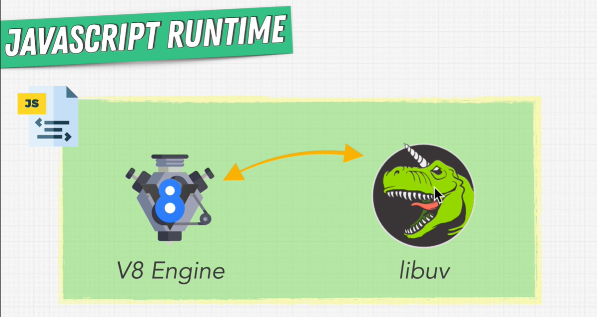

# Section 1

### Node JS — How we got here?

- ❓ What is JS engine?
    
    <aside>
    💡 A JavaScript engine is a computer program that executes JavaScript code.
    
    </aside>
    
- ❓ Difference between Interpreter and JIT (Just In Time) compiler?
    
    `Interpreter` → converts source code into native machine code line by line
    
    `JIT Compiler` → improves the performance by compiling bytecodes into native machine codes at runtime.
    
     
    
- ❓ Does JS uses JIT compiler?
    
    JS is an interpreted language. It is directly interpreted by browsers for execution. But, modern browsers support JIT compilation which converts it to bytecodes for high performance.
    
- ❓ Name some popular JS engine?
    - `Google’s V8` → developed by The Chromium Project for Google Chrome and Chromium web browsers.
    - `Chakra` → developed by Microsoft for its Microsoft Edge web browser.
    - `SpiderMonkey` → used in Mozilla products, including Firefox
    - `Rhino` → written in Java and managed by the Mozilla Foundation as open source
    
    [Explore Javascript Engines | Javascript Engines Guide.](https://www.zeolearn.com/magazine/the-engines-explore-javascript-engines)
    
- ❓ When JS was introduced?
    
    In 1995 → Netscape browser introduced JavaScript.
    
     
    
- ❓ Difference between web 1.0, 2.0, 3.0?
    - `Web 1.0` → Web 1.0 refers to the first stage of the World Wide Web evolution. Earlier, there were only a few content creators in Web 1.0 with a huge majority of users who are consumers of content.
    - `Web -2.0` → Web 2.0 refers to worldwide websites which highlight user-generated content, usability, and interoperability for end users. Web 2.0 is also called the participative social web. It does not refer to a modification to any technical specification, but to modify the way Web pages are designed and used
    
    [Web 1.0, Web 2.0 and Web 3.0 with their difference - GeeksforGeeks](https://www.geeksforgeeks.org/web-1-0-web-2-0-and-web-3-0-with-their-difference/)
    

### Node.js runtime

- ❓ What is runtime?
    
    `runtime` → JavaScript environment which allows to run JS as well as do some extra stuff.
    
- ❓ What is Libuv?
    
    multiplatform C library. It provide support for asynchronous I/O based on event loops. provide the services which helps for things like web server.
    
- ❓ In which language Node.js codebase is?
    
    It is in C++
    
- ❓ What node is?
    
    It is a JavaScript runtime. It helps to run JS code outside the browser.
    
    Its is a binding between v8 engine and libUV to provide a runtime for the JS and do more stuff.
    
    
    
    Node.js
    
- ❓ Is a web browser a JS runtime?
    
    <aside>
    💡 Yes browser is also a JS runtime.
    
    </aside>
    
    A browser contains a JS engine (e. Chrome v8). The engine implements a JS runtime, which includes the call stack, heap, and event loop. The browser also usually includes a set of APIs that augment the JS runtime and make asynchronous code execution possible.
    

### Recall

- How do you run JS
    
    You need runtime. Need to have a JS engine and runtime to run the JS code.
    
    That’s what Node does.
    
- How to run JS code outside the browser?
    
    Need to install Node.js to provide runtime outside the browser.
    
- Node.js architecture
    
    